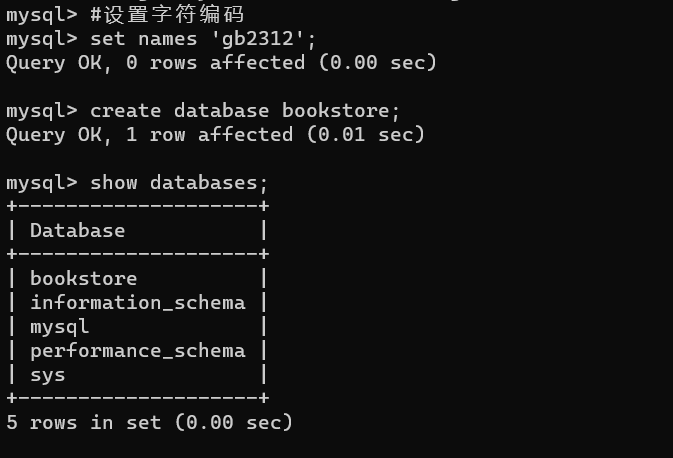

# MySQL实训三-sum26Q

###### 1. 创建“网上书店”bookstore数据库。

```mysql
#设置字符编码
set names 'gb2312';
create database bookstore;
```



2. ###### 在“网上书店”bookstore数据库中创建好如下四个表

<center>user</center>

| 列名                                   | 数据类型    | 允许NULL值 | 约束 | 备注     |
| -------------------------------------- | ----------- | ---------- | ---- | -------- |
| uid                                    | char(4)     | 不允许     | 主键 | 会员编号 |
| uname                                  | varchar(20) |            |      | 会员昵称 |
| email                                  | varchar(20) |            |      | 电子邮箱 |
| tnum1．创建“网上书店”bookstore数据库。 | varchar(15) |            |      | 联系电话 |
| score                                  | int         |            |      | 积分     |

<center>book</center>

| 列名      | 数据类型    | 允许NULL值 | 约束             | 备注     |
| --------- | ----------- | ---------- | ---------------- | -------- |
| bid       | int         | 不允许     | 主键             | 图书编号 |
| bname     | varchar(50) | 不允许     |                  | 图书名称 |
| author    | char(8)     |            |                  | 作者     |
| price     | float       |            |                  | 价格     |
| publisher | varchar(50) |            |                  | 出版社   |
| discount  | float       |            |                  | 折扣     |
| cid       | int         |            | 图书类别表的外键 | 图书类别 |

<center>category</center>

| 列名  | 数据类型    | 允许NULL值 | 约束 | 备注     |
| ----- | ----------- | ---------- | ---- | -------- |
| cid   | int         | 不允许     | 主键 | 类别编号 |
| cname | varchar(16) |            |      | 类别名称 |

<center>b_order</center>

| 列名         | 数据类型 | 允许NULL值 | 约束      | 备注     |
| ------------ | -------- | ---------- | --------- | -------- |
| uid          | char(4)  | 不允许     |           | 会员编号 |
| bid          | int      | 不允许     |           | 图书编号 |
| ordernum     | int      |            | 默认值为1 | 订购量   |
| orderdate    | datetime |            |           | 订购日期 |
| deliverydate | datetime |            |           | 发货日期 |

3. ###### 使用SQL语句分别向user、book、category、b_order表中插入如下数据。

<center>user</center>

| uid  | uname    | email           | tnum        | score |
| ---- | -------- | --------------- | ----------- | ----- |
| 1001 | 何仙姑   | Hxg18@163.com   | 13320101991 | 20    |
| 1002 | 平平人生 | Lp011@126.com   | 13545158219 | 300   |
| 1003 | 四十不惑 | 12345@qq.com    | 18688168818 | 1000  |
| 1004 | 桃花岛主 | 810124@qq.com   | 13068011234 | 600   |
| 1005 | 水灵     | zs123@371.cn    | 15838182503 | 150   |
| 1006 | 感动心灵 | gandong@tom.com | 13641151234 | 500   |

<center>book</center>

| bid    | bname          | author | price | publisher      | discount | cid  |
| ------ | -------------- | ------ | ----- | -------------- | -------- | ---- |
| 1      | 中国时代       | 师永刚 | 39.0  | 作家出版社     | 27.8     | 1    |
| 2      | 中国历史的屈辱 | 王重旭 | 26.0  | 华夏出版社     | 18.2     | 2    |
| 3      | 择业要趁早     | 海文   | 28.0  | 海天出版社     | 19.3     | 3    |
| 4      | 房间           | 爱玛   | 37.6  | 人民文学出版社 | 26.3     | 4    |
| 5      | 平凡的世界     | 路遥   | 75    | 北京出版社     | 63.75    | 4    |
| 6      | 心灵鸡汤       | 关然   | 27.0  | 大豫出版社     | 20.0     | 3    |
| 7      | 蜕             | 赵婷   | 32.0  | 上海出版社     | 28.5     | 3    |
| **8**  | 外婆桥         | 刘静   | 56.5  | 作家出版社     | 39       | 2    |
| **9**  | 花落花开       | 王磊   | 40    | 人民文学出版社 | 23       | 4    |
| **10** | 一家人         | 路遥   | 37    | 人民文学出版社 | 29       | 4    |
| **11** | 植物百科       | 关强   | 26    | 华夏出版社     | 23       | 3    |
| **12** | 秦代史         | 李然   | 66    | 海天出版社     | 59       | 1    |
| **13** | 家风           | 张新   | 37    | 北京出版社     | 29       | 2    |

<center>category</center>

| cid  | cname |
| ---- | ----- |
| 1    | 历史  |
| 2    | 家教  |
| 3    | 文化  |
| 4    | 小说  |

<center>b_order</center>

| uid  | bid  | ordernum | orderdate  | deliverydate |
| ---- | ---- | -------- | ---------- | ------------ |
| 1001 | 1    | 2        | 2016-03-12 |              |
| 1001 | 3    | 1        | 2016-04-15 |              |
| 1001 | 1    | 1        | 2016-09-15 |              |
| 1003 | 7    | 1        | 2015-12-14 |              |
| 1003 | 3    | 1        | 2016-10-10 |              |
| 1003 | 1    | 2        | 2015-03-02 |              |
| 1005 | 5    | 1        | 2015-08-17 |              |
| 1005 | 7    | 3        | 2016-11-12 |              |
| 1006 | 5    | 1        | 2016-09-18 |              |
| 1006 | 1    | 2        | 2016-10-21 |              |
| 1006 | 7    | 2        | 2015-11-21 |              |

首先创建各个表

```mysql
#创建会员表
create table user(
    uid char(4) primary key,
    uname varchar(20),
    email varchar(20),
    tnum varchar(15),
    score int
);

#创建图书表
create table book(
	bid int primary key,
);
```

==注意，由于外键约束，图书类别表（category)，要在图书表（book)之前创建==


